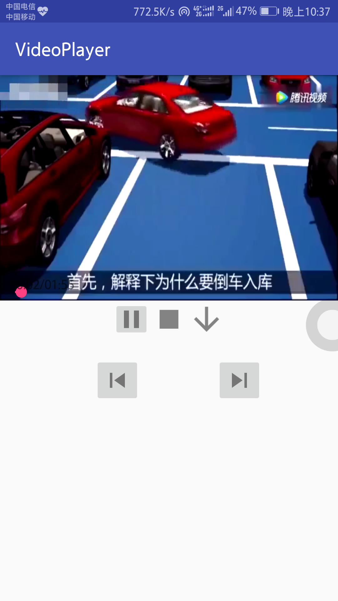

# 红岩半期考核


## 说明
```
实现的功能 
1. 把数据加载出来，⽤列表的形式展示
2. 每个Item需要显示视频的部分具体信息，视频描述，作者名、作者头像
3.进度条，拖动改变视频进度 
4.开始、暂停、停⽌、下一个 & 上一个视频 
5.播放进度保存，再次播放视频跳转到上次播放的位置 
6. 适配了一个读取存储卡动态权限 
```
### 有个问题，不知道为什么有一些手机无法安装本应用，但是如果连在电脑上在进行安装的话就没有问题，如果这个app无法安装，麻烦大佬用电脑安装一下，
:blush::blush::blush:

## 后面有gif，不知道为什么变形了

## 截图如下




## gif如下

